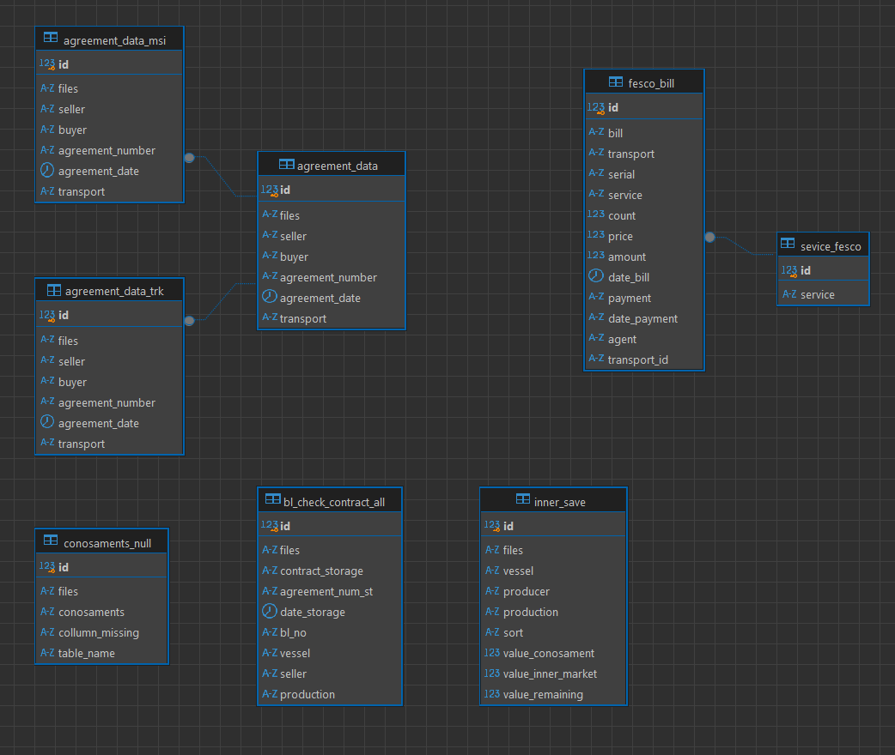

# DB_Checker
Решение позволяющее проводить мониторинг качества данных в БД, включающую организацию миграции данных на сервер PostgresSQL и ее дальнейшую обработку и BI аналитику.

## Структура системы обработки данных


## Рекомендуемое окружение для развертывания

- [PyCharm](https://www.jetbrains.com/pycharm)
- [Docker](https://www.docker.com/)
- [Render](https://render.com/)
- [Preset](https://preset.io/)
- [Grafana](grafana.com/)
- [DBeaver](https://dbeaver.io/)

### Минимальные системные требования:	

  o	x86_64 или arm64, 8 ГБ RAM, SSD 20 ГБ свободного места; 
  
  o	Windows 11 (10), Linux (Ubuntu 18.04+, CentOS, Debian, RHEL);
  
  o	Поддерживаемая оболочка (bash, zsh, fish, PowerShell);
  
  o	Утилиты: tar, wget/curl, dd, chmod.
  
  **Примечание**:
  
o	Для оптимальной работы PyCharm рекомендуется использовать локальное SSD-хранилище;

o	Для работы Pentaho требуется установленный фреймворк JDK v.11;

o	При работе с большими проектами рекомендуется увеличить объем RAM и количество ядер процессора;

o	Для Docker необходимо включить аппаратную виртуализацию в BIOS (для Windows);

o	Следите за нагрузкой на систему при одновременной работе всех компонентов.

## Обзор элементов системы


  ### PowerQuery:

Осуществляет сбор одноименных файлов (Движение **) по рабочей директории. Производит предобработку, объединение файлов способом UNION, приведение витрин к 3 нормальному виду (Устраняются избыточные данные и зависимости).  Итог преобразования 4 витрины данных, представляющих различные аспекты деятельности подразделения.
  
  1.  Формирование единообразных сетов данных из Excel-файлов
  2.  Автоматическое объединение данных из 4 подтабличных структур
  3.  Валидация входных данных на этапе сбора

       
  ### PowerShell :
  
  1.  Автоматическое выполнение каждые 15 минут
  2.  Управление процессом обновления данных

    $file = path_to_file
    
    while ($true) {
        try {
            $excel = New-Object -ComObject Excel.Application
            $excel.Visible = $false
            $excel.DisplayAlerts = $false
            
            $workbook = $excel.Workbooks.Open($file)
            $workbook.RefreshAll()
            
            # Ждем завершения обновления
            Start-Sleep -Seconds 100
            
            $workbook.Save()
            $workbook.Close()
        }
        catch {
            Write-Host "Ошибка: $_"
        }
        finally {
            if ($workbook) {
                [System.Runtime.Interopservices.Marshal]::ReleaseComObject($workbook) | Out-Null
            }
            if ($excel) {
                $excel.Quit()
                [System.Runtime.Interopservices.Marshal]::ReleaseComObject($excel) | Out-Null
            }
            [System.GC]::Collect()
            [System.GC]::WaitForPendingFinalizers()
        }
        
        # Ожидание перед следующим открытием файла
        Start-Sleep -Seconds 660
    }
    
### Pentaho

Программное обеспечение для ETL процессов.  Процесс миграции данных в SQL базу данных осуществляется автоматически согласно заданному времени (16:40 по местному времени).  Процесс проверяет в SQL базе данных находящиеся записи, добавляет, удаляет их в зависимости от проверяемой записи. Если записи нет происходит ее добавление в базу данных, если запись присутствует в базе данных, но ее нет в записях витрины или запись в базе данных не соответствуют записям в витрине данных, происходит ее перманентная замена.
Запуск происходит с помощью вызова скрипта из папки приложения через терминал `./spoon.sh`.


### Python
Производит обработку и визуализацию данных БД для их контроля.
#### Структура данных:

1. **Веб-интерфейс (App_init) на основе Streamlit**: 
  - Выявление дубликатов в реестре договоров по внутреннему рынку (App_init:InnerAgreement.py)
  - Отслеживание не закрытых дополнений по времени (App_init:BLCheckFormat.py)
  - Контроль остатков продукции на складе (App_init: InnerViser.py)
  - Учет логистических операций (App_init:Fesco.py)
  - Операции с PostgresSQL для хранения данных (App_init:SQLink.py)
  - Проверка доступа к приложению данным в streamlit (App_init:LogForm.py)

2. **Обработка данных (DB_Check)**: 
  - Обработка сетов PowerQuery (FrameExcel.py)
  - Проверка пропущенных данных в сетах данных (CheckConosament.py)
  - Выявление дубликатов в реестре договоров по внутреннему рынку (InnerAgreement.py)
  - Отслеживание не закрытых дополнений по времени (CheckBL.py)
  - Контроль остатков продукции на складе (InnerMarketSave.py)
  - Операции с PostgresSQL для хранения данных (SqlCheck.py)
    
3. **Хэширование (ExcelLogChange)**: 
  - Хэширование файлов движение ** (ExcelCheckInst.py)
  - Хранение контрольных сумм для проверки изменений (Redis_Check.py)
    
4. **Автоматизация (dags)**: 
  - Автоматизация миграции данных из SQL (migrate_dag_sql.py)
  
5. **Уведомления (Bot)**: 
  - Отправка уведомлений о состоянии BD_Check, Изменении файлов (Bot_t.py)
  
Запуск происходит по следующим командам:

  o	Streamlit(local): `streamlit run  __run_app__.py --server.address 0.0.0.0 --server.port 8000`

  o	Модули проверки данных вызовом `python __shedule__.py`

### Airflow

Настройка развертывания Airflow:

`docker run -p 8080:8080 -v "path/airflow/dags:/opt/airflow/dags" -v "path/airflow/db:/opt/airflow/db" -v "path:/opt/airflow/Work/Data" -v "path/airflow/scripts:/opt/airflow/scripts" --name airflow apache/airflow:latest bash -c "airflow db init && airflow connections create-default-connections && airflow users create --username airflow --password yourpass --role Admin --email admin@example.com --firstname name --lastname surname && airflow webserver & airflow scheduler"`

После инициализации использовать команду в новом окне терминала для установки пакетов python:

`docker exec --user airflow airflow /home/airflow/.local/bin/pip install openpyxl pandas numpy loguru`

### Telegram

Для работы с Telegram используется библиотека psycopg2 (также построено все на асинхронном  коде, для добавления функций следует учитывать этот момент), данные для доступа находятся в файле bot_instance.toml

### Система баз данных

#### SQL

Основная база данных, расположенная на сервере render.com (подробнее Размещение инфраструктуры). Структура разделена на несколько схем для обработки и хранения данных результата обработки файлов, статуса система, копия витрин данных.



Пример триггера для распределения договоров внутреннего рынка

```
CREATE OR REPLACE FUNCTION data_trk_agreement()
RETURNS TRIGGER AS $$
BEGIN
    IF NEW.seller = 'ТРК' THEN
        INSERT INTO agreement_data_trk(
            files, seller, buyer,
            agreement_number, agreement_date, transport
        )
        VALUES (
            NEW.files, NEW.seller, NEW.buyer,
            NEW.agreement_number, NEW.agreement_date, NEW.transport
        );
    END IF;
    RETURN NEW;
END;
$$ LANGUAGE plpgsql;

create trigger trk_insert
after insert on agreement_data
for each row execute function data_trk_agreement()

```
#### NoSQL 

База данных для хранения значения формата ключ:значение, развернутая на Docker. Используется для отслеживания изменяемых данных файлов Движение** на основе вычисления хэш сумм.
Для использования следует поднять ее следующей командой и создать бд 0 (дефолтное значение).

**Скачивание образа Redis**

`docker pull redis/redis-stack-server:latest`

**Запуск контейнера**

`docker run -d --name redis-stack-server -p 6379:6379 redis/redis-stack-server:latest`

`docker exec -it db_redis redis-cli`

### Grafana x Prometheus

Система для мониторинга за развернутой инфраструктурой на Render.com
Для использования следует создать подключения через integrations (Render.com).
Метрики, для непосредственного мониторинга системы начинаются с префикса ‘render_service’.

### Preset

Приложение для визуализации данных, подключение происходит на основе данных аутентификации к БД. Сложные запросы формируются на основе SQL.

### SonarQube

Приложение для CI/CD, подключение к репозиторию GitHub позволяет проверять код на основные проблемы в коде, а также уязвимости к OWASP-10.

## Размещение инфраструктуры

Архитектура системы построена на принципах микросервисов с возможностью независимого масштабирования каждого компонента. Все сервисы изолированы друг от друга, что обеспечивает надежность и безопасность системы.

### Компоненты Docker

#### Airflow

Многокомпонентная архитектура: 
- Webserver: веб-интерфейс для управления
- Scheduler: планировщик задач
- Worker: исполнители задач
- Все компоненты могут масштабироваться независимо
- Централизованная конфигурация через единый файл

#### Redis

- Единый сервер с возможностью кластеризации
- Высокая производительность за счет in-memory хранения
- Поддержка персистентности данных через snapshotting/AOF

#### Масштабирование
- Airflow: горизонтальное масштабирование worker'ов
- Redis: вертикальное масштабирование или кластеризация

**Резервное копирование**

- Airflow: регулярный бэкап базы данных
- Redis: настройка персистентности и бэкапов дампов

### Компоненты на Render.com

#### Streamlit

- Размещение без использования Docker
- Прямая интеграция с Render.com
- Автоматическое масштабирование
- Настройка переменных окружения через Render Dashboard

#### SQL 

- Управляемая база данных Render.com
- Автоматические резервные копии
- Безопасное подключение через SSL/TLS
  
### Компоненты мониторинга

#### Grafana

- Поддерживает множество источников данных
- Возможность комбинировать данные из разных источников в единый дашборд
- Гибкая настройка через веб-интерфейс
- Масштабируемая архитектура
  
#### SonarQube

- Интегрируется с CI/CD пайплайнами
- Автоматический анализ кода
- Отслеживание технического долга
- Проверка соответствия стандартам безопасности

Преимущества архитектуры
Архитектура позволяет независимо управлять каждым компонентом, обеспечивая высокую отказоустойчивость и масштабируемость системы. Отдельное размещение компонентов на разных платформах (Docker и Render.com) оптимизирует использование ресурсов и упрощает управление инфраструктурой.


