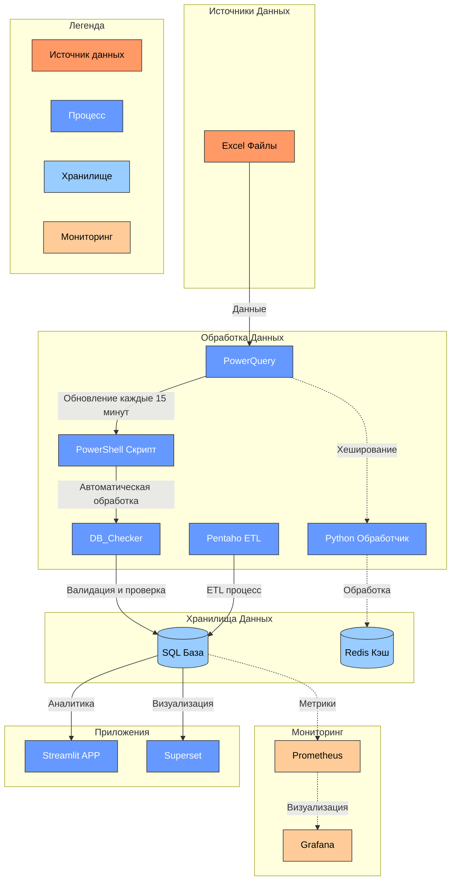

# DB_Checker
Tool For Collect, Migrate, Analyse data 

## Компоненты системы

### Сбор и предварительная обработка данных


  PowerQuery:
  
       - Формирование единообразных сетов данных из Excel-файлов
       - Автоматическое объединение данных из 4 подтабличных структур
       - Валидация входных данных на этапе сбора

       
  PowerShell скрипты:
  
       - Автоматическое выполнение каждые 15 минут
       - Управление процессом обновления данных

### Обработка и хранение данных

  DB_Checker:
  
       -  Проверка пропущенных данных в временных рядах
       -  Выявление дубликатов в реестре договоров
       -  Отслеживание не закрытых дополнений по времени
       -  Контроль остатков продукции на складе
       -  Учет логистических операций
  Redis:
  
       - Кэширование часто используемых данных
       - Хранение контрольных сумм для проверки изменений
       - Быстрый доступ к оперативной информации

### Система баз данных

Пример триггера для распределения договоров внутреннего рынка

```
CREATE OR REPLACE FUNCTION data_trk_agreement()
RETURNS TRIGGER AS $$
BEGIN
    IF NEW.seller = 'ТРК' THEN
        INSERT INTO agreement_data_trk(
            files, seller, buyer,
            agreement_number, agreement_date, transport
        )
        VALUES (
            NEW.files, NEW.seller, NEW.buyer,
            NEW.agreement_number, NEW.agreement_date, NEW.transport
        );
    END IF;
    RETURN NEW;
END;
$$ LANGUAGE plpgsql;

create trigger trk_insert
after insert on agreement_data
for each row execute function data_trk_agreement()

```


## Процесс обработки данных

  1. Чтение Excel-таблиц через PowerQuery
  2. Предварительная валидация и нормализация данных

  3. Запуск PowerShell скриптов по расписанию
  4. Выполнение программы DB_Checker для контроля данных по расписанию
  Обновление Redis-кэша

  5. Сохранение в SQL-базу данных
  6. Обновление данных в Streamlit
  7. Анализ данных через Superset
  8. Передача метрик в Prometheus/Grafana

## Технические особенности
### Контейнеризация

1. Redis, Superset, Prometheus, Grafana развёрнуты в Docker-контейнерах
2. SQL, Streamlit сервер Render.com

Возможность масштабирования отдельных компонентов
Изолированное выполнение сервисов

### Мониторинг

- Система сбора метрик на базе Prometheus
- Визуализация через Grafana dashboards
- Отслеживание состояния компонентов в реальном времени

## Контроль качества и планируемые улучшения
### CI/CD

Использование SonarQube для контроля качества кода
Автоматическое тестирование компонентов
Контроль безопасности и уязвимостей

## Планируемые улучшения

- Интеграция Apache Airflow для оркестрации workflow
  
- Добавление Telegram-бота для уведомлений

- Расширение функционала мониторинга

## Развертывание

Система развёрнута на платформе Render.com, обеспечивающей:

1. Надёжный доступ пользователей к интерфейсу Streamlit
2. Стабильную работу backend-сервисов
3. Возможность горизонтального масштабирования



