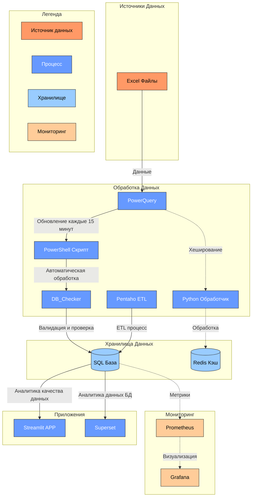

# DB_Checker
==Tool For Collect, Migrate, Analyse data==

## Компоненты системы

### Сбор и предварительная обработка данных


  PowerQuery:
  
  1. Формирование единообразных сетов данных из Excel-файлов
  2.  Автоматическое объединение данных из 4 подтабличных структур
  3.  Валидация входных данных на этапе сбора

       
  PowerShell скрипты:
  
  1. Автоматическое выполнение каждые 15 минут
  2.  Управление процессом обновления данных

    $file = path_to_file
    
    while ($true) {
        try {
            $excel = New-Object -ComObject Excel.Application
            $excel.Visible = $false
            $excel.DisplayAlerts = $false
            
            $workbook = $excel.Workbooks.Open($file)
            $workbook.RefreshAll()
            
            # Ждем завершения обновления
            Start-Sleep -Seconds 100
            
            $workbook.Save()
            $workbook.Close()
        }
        catch {
            Write-Host "Ошибка: $_"
        }
        finally {
            if ($workbook) {
                [System.Runtime.Interopservices.Marshal]::ReleaseComObject($workbook) | Out-Null
            }
            if ($excel) {
                $excel.Quit()
                [System.Runtime.Interopservices.Marshal]::ReleaseComObject($excel) | Out-Null
            }
            [System.GC]::Collect()
            [System.GC]::WaitForPendingFinalizers()
        }
        
        # Ожидание перед следующим открытием файла
        Start-Sleep -Seconds 660
    }


### Обработка и хранение данных

  DB_Checker:

  -  Обработка сетов PowerQuery (DB_Check: FrameExcel.py)
  -  Проверка пропущенных данных в сетах данных (DB_Check:CheckConosament.py)
  -   Выявление дубликатов в реестре договоров по внутреннему рынку (DB_Check:InnerAgreement.py, App_init:InnerAgreement.py)
  -   Отслеживание не закрытых дополнений по времени (DB_Check:CheckBL.py, App_init:BLCheckFormat.py)
  -   Контроль остатков продукции на складе (DB_Check:InnerMarketSave.py, App_init: InnerViser.py)
  -   Учет логистических операций (App_init:Fesco.py)
  -   Операции с PostgresSQL для хранения данных (DB_Check:SqlCheck.py, App_init:SQLink.py)           -   Проверка доступа к приложению  данынм в streamlit (App_init:LogForm.py)

  Redis:
  
  - Кэширование часто используемых данных (ExcelLogChange:ExcelCheckInst.py)
  - Хранение контрольных сумм для проверки изменений (ExcelLogChange:Redis_Check.py)
  - Быстрый доступ к оперативной информации

### Система баз данных

Пример триггера для распределения договоров внутреннего рынка

```
CREATE OR REPLACE FUNCTION data_trk_agreement()
RETURNS TRIGGER AS $$
BEGIN
    IF NEW.seller = 'ТРК' THEN
        INSERT INTO agreement_data_trk(
            files, seller, buyer,
            agreement_number, agreement_date, transport
        )
        VALUES (
            NEW.files, NEW.seller, NEW.buyer,
            NEW.agreement_number, NEW.agreement_date, NEW.transport
        );
    END IF;
    RETURN NEW;
END;
$$ LANGUAGE plpgsql;

create trigger trk_insert
after insert on agreement_data
for each row execute function data_trk_agreement()

```


## Процесс обработки данных

  1. Чтение Excel-таблиц через PowerQuery
  2. Предварительная валидация и нормализация данных

  3. Запуск PowerShell скриптов по расписанию
  4. Выполнение программы DB_Checker для контроля данных по расписанию
  Обновление Redis-кэша

  5. Обработка данных через Pentaho по расписанию
  6. Сохранение в SQL-базу данных
  7. Обновление данных в Streamlit
  8. Анализ данных через Superset
  9. Передача метрик в Prometheus/Grafana

## Технические особенности
### Контейнеризация

1. Redis, Superset, Prometheus, Grafana развёрнуты в Docker-контейнерах
2. SQL, Streamlit сервер Render.com

Возможность масштабирования отдельных компонентов
Изолированное выполнение сервисов

### Мониторинг

- Система сбора метрик на базе Prometheus
- Визуализация через Grafana dashboards
- Отслеживание состояния компонентов в реальном времени

## Контроль качества и планируемые улучшения
### CI/CD

Использование SonarQube для контроля качества кода
Автоматическое тестирование компонентов
Контроль безопасности и уязвимостей

## Планируемые улучшения

- Интеграция Apache Airflow для оркестрации workflow
  
- Добавление Telegram-бота для уведомлений

- Расширение функционала мониторинга

## Развертывание

Система развёрнута на платформе Render.com, обеспечивающей:

1. Надёжный доступ пользователей к интерфейсу Streamlit
2. Стабильную работу backend-сервисов
3. Возможность горизонтального масштабирования



